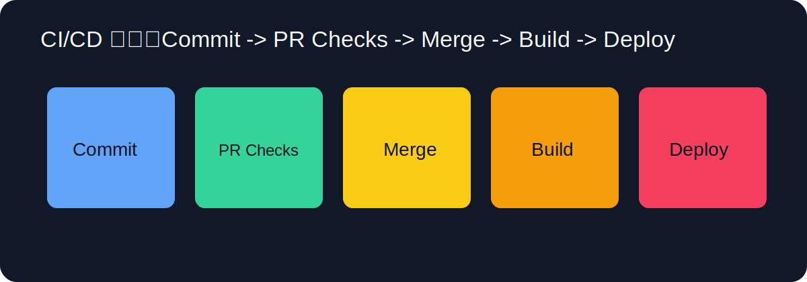

## 导读

CI/CD 的目标不是“把命令搬到云端跑”，而是把团队质量要求固化成可重复执行的系统流程。很多项目在初期能靠经验维持，但随着提交频率升高、协作人数增加，人工检查会迅速失效：有人忘记构建、有人漏跑测试、有人合并了破坏性改动。CI/CD 的价值正是在这里体现出来，它让“应该做”变成“必须通过”，让质量从口头承诺变成客观门禁。

先区分两个概念。CI（持续集成）强调每次提交都被自动验证，核心动作是构建、测试、静态检查。CD（持续交付/持续部署）强调通过验证后自动交付到目标环境。以文档站为例，CI 常见步骤包括 `mkdocs build`、Markdown lint、链接检查，CD 则负责把构建产物发布到静态托管平台。

构建流水线前，先明确“什么才叫通过”。建议把质量门禁拆成三层：

1. 语法与结构层：例如 Markdown 格式、Frontmatter 完整性。
2. 构建与链接层：例如 `mkdocs build --strict`、死链检查。
3. 协作流程层：例如 PR 模板必填、分支保护、评审通过。

只有三层一起运行，流水线才真正稳定。

GitHub Actions 的最小模型是 `on -> jobs -> steps`。`on` 定义触发时机，`jobs` 定义任务，`steps` 定义执行步骤。一个成熟工作流通常包含：代码检出、环境准备、依赖安装、执行检查、上传产物。你可以把它理解为“可版本化的构建脚本”。

在 PR 阶段，推荐执行“快而关键”的检查，避免反馈太慢影响开发节奏。比如文档项目可先跑构建和 lint，链接检查可以保留但要控制超时和重试。合并到 `main` 后再跑发布流程，把 `site` 目录作为产物上传到 Pages。这样做的优点是：PR 阶段主要保障质量，主分支阶段主要保障可发布。

分支保护是 CI/CD 成效的放大器。如果没有保护规则，任何人都能绕过检查直接推 main，流水线会沦为“参考建议”。建议在 GitHub 设置中对 `main` 启用：必须通过状态检查、必须通过 PR 合并、必须解决评审对话。这样流程就具备强制性。

流水线稳定性很大程度取决于依赖可重复性。实践上建议固定关键依赖版本，避免“昨天能过今天失败”的漂移。Python 项目可以固定 requirements 版本范围，Node 项目依赖 lock 文件，Docker 项目尽量固定基础镜像 tag。你不一定要一开始就完全锁死，但至少要避免 `latest` 到处漂移。

在文档站场景中，常见失败有三类：第一，构建失败（语法或导航引用错误）；第二，链接检查失败（外链波动或拼写错误）；第三，发布失败（权限配置、产物路径、Pages source 设置不一致）。这三类问题都能通过日志快速定位。Actions 日志阅读建议从“第一处红色错误”开始，不要从最后一行倒推。

如果你希望加速反馈，可以用并行 Job：构建、lint、链接检查分开跑；最终汇总状态作为 PR 门禁。这样单个检查失败不会阻塞其他检查输出，开发者可以一次看到全部问题，而不是改完一个再触发下一个。

缓存也是 CI 优化重点。Python 可缓存 pip，Node 可缓存 npm/pnpm，Docker 可用 BuildKit 缓存层。缓存策略的目标不是“尽可能缓存一切”，而是“在依赖未变化时跳过重复下载”。过度缓存会引入陈旧依赖风险，建议在 key 中包含 lock 文件哈希。

发布策略建议先采用“主分支自动发布”，再逐步演进到“tag 发布”或“环境分级发布”。对于教程站点，主分支自动发布通常足够；对于业务服务，通常会有 dev/staging/prod 分层，配合审批与回滚策略。无论哪种策略，最关键的是可回滚：你必须知道“坏版本怎么撤回”。最常见方式是 `git revert` 触发一次新构建并发布。

观测方面，建议把流水线状态与失败原因做可见化统计。哪类检查最常失败、平均耗时多长、失败后平均修复时长多少，这些指标能帮助你持续优化流程。CI/CD 不是一次性配置，而是持续改进系统。

安全方面不要忽视 Secrets 管理。敏感令牌应存放在 GitHub Secrets，工作流通过环境变量读取，不要写进仓库。对于第三方 Action，优先选择官方或高可信项目，并固定版本标签，减少供应链风险。若项目敏感度高，可开启依赖审计与代码扫描。

一个通用的文档发布链路可以概括为：开发者在功能分支提交 -> 发起 PR 触发 CI -> 检查通过后合并主分支 -> 发布工作流构建并部署 -> 站点自动更新。这条链路的优势是低成本、可追踪、可复现，适合个人与团队长期维护。

如果你是新手，最好的练习方式不是一次写复杂流水线，而是先保证最小闭环可用：构建一定可跑通，失败一定可读懂，修复一定能重现。只要这个闭环稳定，再逐步加入更严格的质量门禁与安全策略，成功率会高得多。

## 流水线可维护性的设计原则

CI/CD 早期最常见的问题不是“不会写 YAML”，而是“规则增长后没人敢改”。要让流水线可维护，建议坚持三条原则：第一，步骤命名清晰，让新人能一眼看懂失败点；第二，单个 Job 职责单一，避免把构建、测试、发布硬塞在一起；第三，失败可复现，尽量提供本地等价命令。这样即使规则越来越多，仍然能快速定位和修复。

另一个关键点是产物管理。构建结果建议显式上传并标注版本，既方便排查也方便回滚。对于静态站点，可以保留最近若干次构建产物；对于业务服务，应搭配镜像标签和发布记录，形成完整审计链路。CI/CD 的成熟度最终体现为“发生问题时能否快速恢复”，而不是“平时看起来很自动化”。

## 常用命令与参数清单（可直接查阅）

### 本地 CI 预检

- `mkdocs build --strict`：严格模式构建。
- `markdownlint-cli2 "**/*.md"`：Markdown 规范检查。
- `lychee README.md docs/**/*.md --no-progress`：链接检查。

### GitHub Actions 关键概念

- `on: pull_request`：PR 触发。
- `on: push`：分支推送触发。
- `workflow_dispatch`：手动触发。
- `runs-on: ubuntu-latest`：执行环境。
- `needs:`：定义 Job 依赖关系。

### 发布与回滚策略

- 正常发布：合并 `main` 触发自动部署。
- 紧急回滚：`git revert <bad-commit>` 后推送，触发重新部署。
- 禁止热修绕过：通过分支保护禁止直接 push main。

### 优化建议参数

- `actions/setup-python` 指定固定版本，如 `3.12`。
- 链接检查增加重试与超时配置，减少外网抖动误报。
- 对第三方 Action 固定版本号，不使用浮动标签。

## 延伸阅读

- [GitHub Actions 文档](https://docs.github.com/en/actions)
- [GitHub Pages 文档](https://docs.github.com/en/pages)
- [Workflow syntax](https://docs.github.com/en/actions/using-workflows/workflow-syntax-for-github-actions)
- [Continuous Delivery Overview](https://martinfowler.com/bliki/ContinuousDelivery.html)
