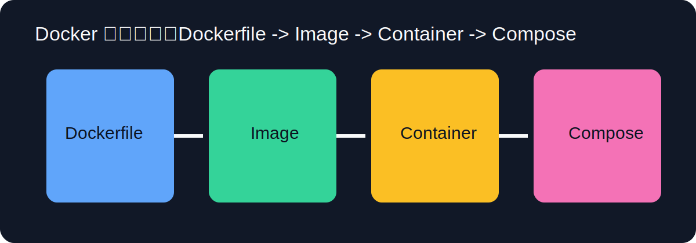

## 导读



Docker 的流行不是因为它“新”，而是因为它解决了软件交付里最反复、最昂贵的问题：环境不一致。开发机能跑、测试机报错、生产机异常，这类问题本质上是“运行环境不可复制”。Docker 提供的核心能力是把应用和依赖打包成可移植镜像，再在任意符合标准的主机上按同样方式运行。它并不替代操作系统，也不神化隔离，而是用更轻量的方式实现“同构交付”。

要用好 Docker，先建立一个简单模型：镜像是配方，容器是实例，仓库是分发中心。镜像由多层文件系统叠加而成，每层由 Dockerfile 指令生成。容器启动时会在镜像只读层之上挂一个可写层，进程在这个上下文中运行。理解“分层 + 缓存”后，你就知道为什么 Dockerfile 的指令顺序会直接影响构建速度与镜像体积。

安装完成后先跑体检命令：

```bash
docker version
docker info
docker compose version
```

如果 `Cannot connect to the Docker daemon`，先检查 Docker Engine/Desktop 是否启动，再确认当前用户是否有访问 Docker socket 的权限。Linux 下常见做法是把用户加入 `docker` 组，但要明确这会带来接近 root 的能力，生产环境应结合最小权限原则审慎配置。

容器生命周期从 `run` 开始。最常见命令看似简单，参数却决定了行为边界：

```bash
docker run -d --name web -p 8080:80 --restart unless-stopped nginx:alpine
```

`-d` 后台运行，`--name` 命名容器，`-p` 暴露端口，`--restart` 定义重启策略。许多线上稳定性问题都来自“默认参数没配”，例如容器异常退出后没有自动恢复、端口映射错误导致服务不可达。你可以随时用 `docker ps -a` 与 `docker logs` 检查状态：

```bash
docker ps -a
docker logs --tail 200 -f web
```

`--tail` 限制输出行数，`-f` 持续跟踪。日志是容器排障第一入口，尤其在你尚未接入集中日志系统时。

镜像构建建议尽早养成“先稳定依赖层，再复制业务代码”的顺序。一个典型 Node 项目若先 `COPY . .` 再 `npm ci`，任何源码变化都会让依赖层缓存失效，构建时间急剧上升。更优写法是先复制 `package*.json` 安装依赖，再复制源码，最后构建产物。多阶段构建则进一步把构建工具与运行环境分离，显著减小最终镜像：

```Dockerfile
FROM node:20-alpine AS build
WORKDIR /app
COPY package*.json ./
RUN npm ci
COPY . .
RUN npm run build

FROM nginx:alpine
COPY --from=build /app/dist /usr/share/nginx/html
EXPOSE 80
CMD ["nginx", "-g", "daemon off;"]
```

这段 Dockerfile 的逻辑很清晰：第一阶段负责编译，第二阶段只保留运行所需静态文件。好处是最终镜像更小、攻击面更小、拉取更快。你可以用 `docker history` 或 `docker images` 对比优化前后差异：

```bash
docker build -t web:local .
docker images | grep web
docker history web:local
```

容器数据持久化必须通过 volume 或 bind mount，不应依赖容器可写层。因为容器删除后，可写层会一起消失。数据库、上传目录、缓存目录都应该映射到可管理的存储。常见方式：

```bash
docker run -d --name redis -v redis_data:/data redis:7-alpine
```

这里 `redis_data` 是命名卷，Docker 会在宿主机管理生命周期。对于开发场景，bind mount `-v $(pwd):/app` 能实现代码热更新；但在生产环境，bind mount 需要更严格权限与路径治理，避免宿主文件被容器误改。

网络方面，Docker 默认提供 bridge 网络。单容器场景直接端口映射即可；多容器场景建议通过自定义网络和服务名通信，不要硬编码 IP。Compose 在这方面非常友好：同一 Compose 项目内，服务名天然可解析为 DNS 记录。

Compose 的价值是把“多命令启动”变成“声明式编排”。当你的系统至少包含 Web、DB、Cache 三种组件时，手动 `docker run` 很快失控。`docker-compose.yml` 能把镜像、端口、依赖、环境变量、卷挂载统一描述：

```yaml
services:
  app:
    build: .
    ports:
      - "8080:80"
    depends_on:
      - redis
    environment:
      APP_ENV: development

  redis:
    image: redis:7-alpine
    volumes:
      - redis_data:/data

volumes:
  redis_data:
```

使用时通常是：

```bash
docker compose up -d --build
docker compose ps
docker compose logs -f app
```

要注意 `depends_on` 只保证启动顺序，不保证服务“已就绪”。如果上游服务启动慢，应用仍可能在启动时连接失败。稳妥策略是增加健康检查、重试机制或启动前等待脚本。

安全层面，Docker 初学者最容易忽略两点：第一，尽量不用 root 用户运行业务进程；第二，避免把敏感信息写死在镜像里。可以在 Dockerfile 中添加非 root 用户，运行时通过环境变量或 secret 注入配置。不要把 `.env`、私钥、证书直接 COPY 进镜像；即使后续删除，也可能在历史层中残留。

排错时建议遵循“容器状态 -> 端口映射 -> 应用进程 -> 网络连通 -> 存储权限”的顺序。很多故障都能在前两步定位。例如服务不可访问，先看容器是否 `Up`，再看 `docker port` 映射是否正确；若都正常，再 `docker exec -it` 进入容器检查进程与配置。命令如下：

```bash
docker ps
docker port web
docker exec -it web sh
ss -tulpen
```

当磁盘爆满时，用 `docker system df` 分析占用，再有选择地清理。`docker system prune` 很方便，但会删除未使用资源，生产环境需谨慎。清理前务必确认 volume 是否承载关键数据。

如果你在多架构环境构建镜像，可能遇到 `exec format error`，此时可在构建或运行时显式指定平台参数。

综合来看，Docker 真正提升的是工程确定性。你把“环境依赖、启动命令、配置约束、网络关系”写进可版本化文本，团队协作就不再依赖口口相传。

## 资源限制与运行稳定性

很多容器在开发环境“看起来正常”，到了多人共享环境就会出现争抢资源或崩溃。原因不是镜像构建问题，而是运行参数缺少边界。建议为容器声明 CPU、内存、进程限制。

```bash
docker run -d \
  --name api \
  --cpus=\"1.5\" \
  --memory=\"512m\" \
  --pids-limit=200 \
  --restart=unless-stopped \
  my-api:latest
```

`--cpus` 和 `--memory` 用于资源配额，`--pids-limit` 防止异常 fork，`--restart` 确保进程退出后可自恢复。对于 Compose，也可以在配置中统一这些约束。

## 常用命令与参数清单（可直接查阅）

### 镜像构建与管理

- `docker build -t app:1.0 .`：`-t` 指定标签。
- `docker build --no-cache -t app:clean .`：禁用缓存重建。
- `docker pull nginx:alpine`：拉取镜像。
- `docker images`：查看本地镜像。
- `docker rmi image:tag`：删除镜像。

### 容器运行与运维

- `docker run -d --name web -p 8080:80 image`：后台运行并映射端口。
- `docker run --rm -it image sh`：临时交互容器，退出后自动删除。
- `docker ps -a`：查看容器（含停止）。
- `docker logs -f --tail 100 web`：跟踪日志。
- `docker exec -it web sh`：进入运行中容器。
- `docker inspect web`：查看容器详细元数据。

### 存储与网络

- `docker volume ls`：列出卷。
- `docker volume inspect redis_data`：查看卷细节。
- `docker network ls`：列出网络。
- `docker network inspect bridge`：检查网络拓扑。

### Compose

- `docker compose up -d --build`：后台启动并构建。
- `docker compose down`：停止并移除容器网络。
- `docker compose down -v`：同时删除关联卷。
- `docker compose config`：输出合并后的最终配置。
- `docker compose logs -f service`：跟踪指定服务日志。

### 清理与诊断

- `docker system df`：查看镜像/容器/卷占用。
- `docker system prune`：清理未使用资源（谨慎）。
- `docker stats`：实时资源监控。

## 延伸阅读

- [Docker 官方文档](https://docs.docker.com/)
- [Dockerfile Best Practices](https://docs.docker.com/develop/develop-images/dockerfile_best-practices/)
- [Compose Specification](https://compose-spec.io/)
- [Container Security Guide](https://cheatsheetseries.owasp.org/cheatsheets/Docker_Security_Cheat_Sheet.html)
