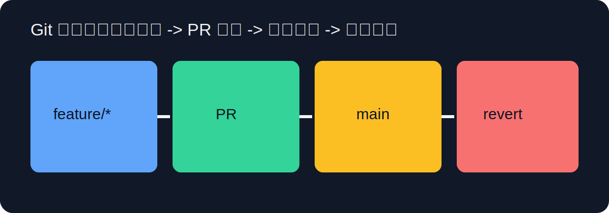

# Git 完整指南



很多新手学习 Git 会卡在两个地方：第一，命令太多，背完很快忘；第二，遇到冲突就慌，不知道该保留什么。要解决这两个问题，最有效的方法不是继续背命令，而是先理解 Git 的设计目标。Git 的核心目标只有一件事：**让你能够安全地记录、比较、回退、合并和共享代码历史**。命令多只是界面，历史模型才是本体。

把 Git 当作“时间机器”并不准确，它更像“快照数据库”。每次提交不是记录“这一行从 A 变 B”，而是记录“当前项目在这个时间点的完整状态”，并通过哈希把这些状态串成有向图。你平时看到的 `main`、`feature/x`、`v1.0.0`，本质上只是指向某个提交对象的引用。这个理解非常关键，因为它能解释为什么 `reset` 会改变引用，`revert` 会新增提交，`rebase` 会重写历史。

开始使用 Git 之前，先把身份配置好，并确认默认分支策略。建议团队统一使用 `main` 作为发布分支，所有开发从 `feature/*` 分支发起，最终通过 Pull Request 合并。基础配置命令如下：

```bash
git --version
git config --global user.name "Your Name"
git config --global user.email "you@example.com"
git config --global init.defaultBranch main
git config --global pull.rebase true
```

`pull.rebase=true` 的意义在于减少无意义 merge commit，让历史更线性、更易读。当然，这不是教条规则；如果你的团队偏好 merge-based 流程，也可以关闭它，但必须统一，不要一半人 rebase 一半人 merge。

日常开发的最小闭环其实非常稳定：修改代码 -> `git status` 查看变化 -> `git add` 选择提交内容 -> `git commit` 生成快照 -> `git push` 同步远程。关键是“提交粒度”。高质量提交应当具备单一意图，能在 `git log` 里看出清晰演进路径。示例：

```bash
git status
git add src/auth/login.ts
git commit -m "feat(auth): add token refresh handler"
git push -u origin feature/token-refresh
```

如果你习惯 `git add .` 一把梭，短期看快，长期会放大回滚成本。更稳妥的方式是使用 `git add -p` 交互式暂存，把一个大改动拆成多个逻辑独立提交。`-p` 参数会逐段询问是否暂存该 hunk，这在代码审查和回溯时价值极高。

理解工作区、暂存区、提交历史三者关系，是掌握“撤销类命令”的前提。你可以把它想象成三层状态池：工作区是正在编辑的文件，暂存区是准备提交的内容，提交历史是已确认快照。不同命令作用在不同层：

- `git restore file` 回退工作区改动。
- `git restore --staged file` 把文件从暂存区撤回工作区。
- `git reset --soft HEAD~1` 回退提交但保留暂存区状态。
- `git reset --mixed HEAD~1` 回退提交并清空暂存区（保留工作区）。
- `git reset --hard HEAD~1` 全面回退（高风险）。

你会发现，Git 并不神秘，只是状态转换清晰且严格。只要先确认“我要改的是哪一层”，再选命令，误操作概率会下降很多。

分支协作阶段，推荐采用 GitHub Flow：`main` 始终保持可发布，功能在短生命周期分支开发，完成后通过 PR 合并。典型步骤如下：

```bash
git switch main
git pull origin main
git switch -c feature/profile-settings
# 开发与提交
git push -u origin feature/profile-settings
```

当你准备发 PR 前，建议先同步主干最新状态：

```bash
git fetch origin
git rebase origin/main
```

这一步会把你的提交“重放”到最新 `main` 之后，避免 PR 合并时再处理一轮冲突。冲突出现时，不要急着全部接受一侧，而应先理解冲突语义：是同一行文本冲突，还是同一逻辑冲突。前者易解，后者通常需要回到需求定义讨论。解决后使用：

```bash
git add <resolved-files>
git rebase --continue
```

如果你发现重放路径选错了，立即 `git rebase --abort` 返回原状态。很多人把 rebase 当成高风险操作，主要是因为在错误状态下硬继续；只要你知道 abort 能撤回，本质风险可控。

发布阶段建议使用 tag 管理版本，而不是靠分支名口头约定。`git tag -a v1.2.0 -m "release: v1.2.0"` 会生成带注释标签，便于后续审计与回滚。出现线上缺陷时，优先使用 `git revert` 生成“反向提交”撤销问题代码，而不是直接改写公共历史。命令如下：

```bash
git revert <bad_commit_sha>
git push origin main
```

`revert` 的核心价值在于保留审计链条，团队成员不会因为历史被重写而本地状态错乱。除非你在处理“密钥泄露”“非法大文件”等必须清理历史的问题，否则不建议对共享分支执行强制重写。

Git 排错最重要的工具是 `reflog`。`log` 只看可达历史，`reflog` 记录“HEAD 和引用移动轨迹”，即便提交被 reset 掉，也常常能找回。常见恢复流程是：

```bash
git reflog -n 30
# 找到目标提交 SHA
git branch recover/<name> <sha>
# 或直接 cherry-pick 回当前分支
git cherry-pick <sha>
```

当你误删分支、误 reset、误切换状态时，先停下来跑 `reflog`，不要连续执行更多破坏性命令。很多“无法恢复”的案例其实是“本来可恢复，但后续操作覆盖了证据”。

如果你的仓库被提交了密码、token、私钥，处置顺序必须是：先旋转凭证，再清理历史。只做历史清理而不旋转密钥，是不完整且危险的。因为凭证可能早已被拉取、缓存或镜像。Git 层面的治理只能减少暴露面，不能替代安全应急流程。

团队维度上，Git 最容易被忽略的是“约定”。建议至少统一三件事：提交消息规范、分支命名规范、PR 最小信息模板。你现在的项目已经有 PR 模板，这是好的起点。接下来应持续强化：每个 PR 描述要包含变更目的、验证方式、风险与回滚方案。技术协作质量，往往决定于这些看似“非代码”的细节。

下面给出一段用于日常诊断仓库状态的命令组合，你可以把它做成 alias：

```bash
git status -sb
git log --oneline --graph --decorate -n 20
git remote -v
git branch -vv
git stash list
```

`status -sb` 以简洁模式显示分支与改动，`branch -vv` 能看到本地分支与远程跟踪关系，适合在“推不动、拉不齐、分支漂移”时快速定位问题。

## 常用命令与参数清单（可直接查阅）

### 提交与查看

- `git status -s -b`：`-s` 简洁输出，`-b` 显示分支信息。
- `git add -p`：交互式暂存，按代码块选择。
- `git commit -m "msg" --amend`：修改最近一次提交（未共享时使用）。
- `git log --oneline --graph --decorate -n 30`：图形化查看最近历史。
- `git show <sha>`：查看指定提交详情。

### 分支与同步

- `git switch -c feature/x`：创建并切换新分支。
- `git fetch origin --prune`：同步远程并清理已删除引用。
- `git pull --rebase origin main`：拉取并变基到最新主干。
- `git push -u origin feature/x`：首次推送并建立跟踪关系。

### 撤销与恢复

- `git restore file`：撤销工作区改动。
- `git restore --staged file`：撤销暂存。
- `git reset --soft HEAD~1`：回退提交保留暂存区。
- `git reset --hard <sha>`：强制回退到指定提交（高风险）。
- `git revert <sha>`：生成反向提交撤销改动。

### 历史治理与发布

- `git tag -a v1.0.0 -m "release"`：创建注释标签。
- `git push origin v1.0.0`：推送标签。
- `git rebase -i HEAD~5`：交互式整理最近 5 次提交。
- `git cherry-pick <sha>`：把指定提交拣选到当前分支。

## 延伸阅读

- [Pro Git（中文版）](https://git-scm.com/book/zh/v2)
- [Git 官方文档](https://git-scm.com/docs)
- [GitHub Flow](https://docs.github.com/en/get-started/using-github/github-flow)
- [Atlassian Git Tutorials](https://www.atlassian.com/git/tutorials)
