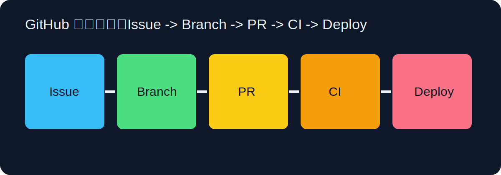

## 导读



如果把 Git 看作“本地与分布式版本控制引擎”，那么 GitHub 就是围绕 Git 构建的协作平台。很多新手会把 Git 和 GitHub 混为一谈，导致学习路径混乱。最直接的区分方式是：Git 负责记录历史，GitHub 负责组织协作。你在本地提交代码是 Git，发起 Pull Request、讨论需求、自动运行 CI、发布 Pages 是 GitHub。理解这层分工后，你会更快建立稳定工作流。

从零上手的第一步是账号与安全设置。建议注册后立即完成三项基础配置：邮箱验证、双因素认证（2FA）、SSH 公钥添加。2FA 可以显著降低账号被盗风险；SSH 可以避免每次 push 输入密码，并且更适合长期工程协作。你在本地生成公钥后，把 `~/.ssh/id_ed25519.pub` 内容粘贴到 GitHub `Settings -> SSH and GPG keys`，再执行：

```bash
ssh -T git@github.com
```

如果显示认证成功，说明链路可用。随后就可以创建仓库。新手常见困惑是“仓库该选 Public 还是 Private”。建议学习阶段优先 Public（便于作品展示与社区互动），业务项目默认 Private（控制访问范围）。创建仓库时勾选 README、.gitignore 和 License 会更方便，尤其是团队协作时，仓库元信息完整能减少沟通成本。

把本地项目推到 GitHub 时，先绑定远程地址，再推送主分支：

```bash
git remote add origin git@github.com:<username>/<repo>.git
git branch -M main
git push -u origin main
```

`-u` 参数会建立本地分支与远程分支的跟踪关系，后续可以直接 `git push` 和 `git pull`。如果你的项目已经存在远程仓库，先 `git clone` 再开发更稳妥，能避免历史冲突。

GitHub 的核心协作单元不是“直接推 main”，而是“分支 + Pull Request”。推荐流程：从 `main` 拉出 `feature/*` 分支，在分支完成开发并推送，然后发起 PR。PR 页面不仅用于合并代码，还用于解释变更目的、风险、验证方式。高质量 PR 描述通常包含：做了什么、为什么做、怎么验证、可能影响、如何回滚。

当你发起 PR 后，GitHub 会把差异、评论、检查结果集中呈现。评审人可以逐行评论、建议修改、请求补充测试。这个流程看似增加了步骤，但它能显著降低“单人盲改”导致的线上风险。对新手来说，PR 更大的价值是留下思考轨迹：你为什么这么改、别人为什么建议改、最后如何达成一致。这些讨论记录是最好的学习素材。

Issue 是 GitHub 里另一个关键能力。很多团队把需求、缺陷、任务都写在 Issue 里，再通过 PR 关联 Issue 实现闭环。建议标题明确、描述可复现、标签清晰。比如 bug Issue 至少应包含环境、复现步骤、预期结果、实际结果、日志截图。你把问题定义得越清楚，修复速度越快，误判越少。

Projects 则是把 Issue/PR 组织成看板的工具，适合管理中小型迭代。对个人开发者而言，最实用的起点是建立 `Todo / In Progress / Done` 三列，把 Issue 拖动即可追踪状态。它不是“必须工具”，但当任务超过十个后，你会明显感觉到结构化管理带来的效率提升。

权限管理在团队协作中非常关键。GitHub 提供 Owner、Maintainer、Write、Read 等角色模型。建议遵循最小权限原则：需要合并的人给写权限，需要查看的人给读权限；生产仓库启用分支保护，禁止直接推送 main，要求 PR 必须通过 CI 才能合并。很多“事故提交”都不是技术难题，而是权限策略太松。

分支保护（Branch Protection）建议至少启用以下规则：

1. Require a pull request before merging。
2. Require status checks to pass（例如文档构建、lint、链接检查）。
3. Require conversation resolution before merging。
4. Restrict who can push to matching branches。

这些策略会把“人为约定”转成“系统约束”，让流程一致性更强。

GitHub Actions 是自动化中枢。你可以把“构建、测试、部署”写成 YAML 工作流，触发条件可以是 push、pull_request、定时任务或手动触发。对新手来说，最重要的不是记住所有语法，而是先理解三件事：触发时机（on）、执行环境（runs-on）、执行步骤（steps）。

一个最小可用工作流结构如下：

```yaml
name: CI
on:
  pull_request:
  push:
    branches: [main]

jobs:
  build:
    runs-on: ubuntu-latest
    steps:
      - uses: actions/checkout@v4
      - run: echo "run checks"
```

你可以在此基础上逐步叠加检查项。建议先保证构建可用，再增加 lint 和链接检查，最后考虑更严格的安全扫描。一次加太多规则会导致新手频繁失败，反而降低流程接受度。

GitHub Pages 适合文档站、项目主页和教程站发布。采用 Actions 构建后发布通常比“手工上传静态文件”更稳定。配置关键点包括：`Settings -> Pages` 选择 GitHub Actions、Workflow 里正确上传静态产物、主分支触发部署。部署后通常几分钟可访问，如果页面空白，优先检查工作流日志与 `site_url` 配置。

日常协作中，建议把“提交规范 + PR 模板 + CI 门禁 + 保护分支”打包成默认工程模板。这样无论是个人项目还是团队项目，都能快速复用一致的协作基线。你会明显感受到，GitHub 用得越规范，返工越少，沟通成本越低。

下面给出一个新手可以直接复用的 GitHub 日常节奏：先从 Issue 明确任务，再在 feature 分支开发，提交后发 PR，等待 CI 通过与评审意见，合并后自动发布，最后回到 Issue 关闭任务并复盘。这个流程看起来比“改完直接 push”慢一点，但它把质量、可追踪性和协作效率同时提升了。

如果你计划把 GitHub 用于个人成长，建议固定三项长期动作：第一，持续维护 README，让别人能快速理解你的项目价值；第二，定期整理 Release Notes，训练结构化表达；第三，主动参与开源仓库的小修复或文档贡献，快速提升协作能力。GitHub 不只是代码托管平台，它也是你的公开工程档案。

## 新手常见误区与改进路径

第一类常见误区是“把 GitHub 当网盘用”，只会上传代码，不写 README、Issue、PR 描述。结果是项目能看不能协作。改进方式很简单：每次提交都补一句清晰 commit message，每次 PR 都写“目的-变更-验证-风险”四段式说明。第二类误区是“主分支直接开发”，看似省步骤，实际会让回滚和审查成本飙升。把开发改到 feature 分支，是最小成本的质量提升。

第三类误区是“只看成功，不看失败”。真正提升水平的路径通常来自失败日志：CI 为什么失败、哪一步最慢、评论里被反复指出什么问题。你把这些信息整理成固定清单，下一次提交质量会明显提高。对初学者来说，GitHub 不是“学会几个按钮”，而是学会一套可复用的协作方法。

## 常用操作与命令清单（可直接查阅）

### 仓库连接与同步

- `git clone git@github.com:user/repo.git`：克隆仓库。
- `git remote -v`：查看远程地址。
- `git remote set-url origin <new-url>`：修改远程地址。
- `git fetch origin --prune`：拉取并清理远程已删除分支引用。

### 分支与 PR 前准备

- `git switch -c feature/topic`：创建功能分支。
- `git push -u origin feature/topic`：推送并建立跟踪。
- `git pull --rebase origin main`：同步主干并重放提交。
- `git log --oneline --graph --decorate -n 20`：查看提交结构。

### 常见 GitHub 网页操作要点

- New Issue：明确背景、复现步骤、影响范围。
- New Pull Request：写清楚变更目的、验证方法、风险与回滚。
- Review：对代码给出可执行建议，避免抽象评价。
- Merge：优先在 CI 通过且评论处理完成后进行。

### Actions 与发布

- 在 `Actions` 页查看每一步日志。
- 失败优先看第一条报错，而不是最后一条。
- Pages 发布失败先检查工作流权限与产物路径。

### 常见参数与概念

- `git push --force-with-lease`：更安全的强推，避免覆盖他人新提交。
- `git pull --rebase`：保持历史线性。
- `Draft PR`：草稿 PR，适合先讨论方案后再正式评审。

## 延伸阅读

- [GitHub Docs](https://docs.github.com/)
- [Managing pull requests](https://docs.github.com/en/pull-requests)
- [About issues](https://docs.github.com/en/issues/tracking-your-work-with-issues/about-issues)
- [GitHub Actions 快速入门](https://docs.github.com/en/actions/quickstart)
- [GitHub Pages 文档](https://docs.github.com/en/pages)
