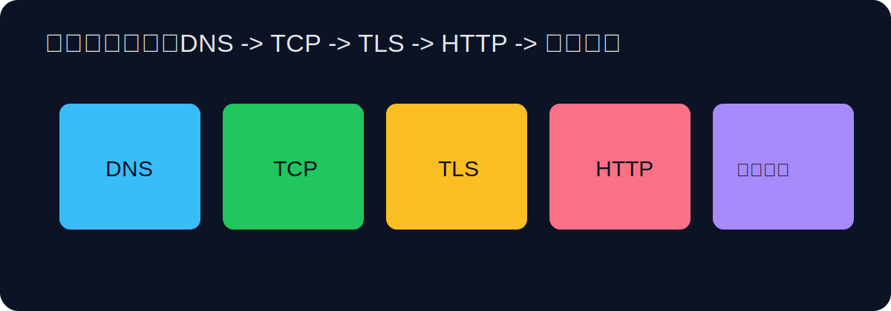

# 网络基础与故障诊断完整指南



在工程现场，很多“应用问题”最终都会回到网络问题：域名解析不稳定、端口不通、TLS 握手失败、网关超时、上游服务偶发抖动。网络排障最常见的误区是“抓到一个报错就直接下结论”。更可靠的方式是建立分层模型：先确认名称解析，再确认 TCP 连通，再确认协议行为，最后确认应用逻辑。你把层次分清，定位速度会明显提升。

先说 DNS。用户访问 `api.example.com`，第一步不是连接服务器，而是把域名解析成 IP。如果 DNS 解析异常，后续所有动作都无从谈起。排查时建议先看本机解析结果，再与公共 DNS 对比：

```bash
nslookup api.example.com
dig api.example.com +short
dig @8.8.8.8 api.example.com +short
```

如果本机与公共 DNS 结果差异明显，优先怀疑本地缓存、企业 DNS 策略或解析传播延迟。你还可以检查 TTL，判断缓存更新窗口是否合理。

确认 IP 后，下一层是 TCP/UDP 端口连通。很多时候服务“看起来在线”，但端口被防火墙或安全组阻断。快速验证方式是 `nc`：

```bash
nc -zv api.example.com 443
nc -zv db.internal 5432
```

`-z` 只扫描不发送数据，`-v` 输出详细结果。若端口不可达，优先检查安全组、ACL、主机防火墙以及监听地址是否绑定到 `0.0.0.0` 或正确网卡。

HTTP 层诊断建议从 `curl` 开始。`curl -I` 看响应头，`curl -v` 看 TLS 与请求细节，`curl -w` 可输出耗时指标。示例：

```bash
curl -I https://api.example.com/health
curl -v https://api.example.com/health
curl -s -o /dev/null -w 'code=%{http_code} dns=%{time_namelookup} tcp=%{time_connect} tls=%{time_appconnect} total=%{time_total}\n' https://api.example.com/health
```

最后一条命令非常实用，它把 DNS、TCP、TLS、总耗时拆开，让你知道慢在哪里。比如 DNS 慢说明解析链路问题，`time_connect` 慢说明网络路径或端口拥堵，`time_appconnect` 慢说明 TLS 握手问题，`time_total` 慢但前几项正常则可能是应用处理慢。

排查 4xx/5xx 状态码时要结合网关与上游拓扑理解。`502 Bad Gateway` 通常是网关访问上游失败，`504 Gateway Timeout` 通常是网关等待上游超时，`503 Service Unavailable` 常见于限流或实例不可用。你不能只看客户端报错，还要同时看网关日志和上游服务日志，按时间戳对齐。

本机网络状态排查常用 `ip` 与 `ss`。`ip addr` 看网卡与地址，`ip route` 看路由，`ss -tulpen` 看监听与连接。如果一个服务在本机访问正常、外部访问失败，通常是监听地址或防火墙问题。比如应用只监听 `127.0.0.1`，外部自然无法访问。

```bash
ip addr
ip route
ss -tulpen | grep 8080
```

当问题复杂到“链路上某一跳间歇性失败”时，可以用 `traceroute` 看路径跳点，用 `mtr` 做持续观测。它们不能直接告诉你业务根因，但能帮助确认丢包发生在哪段网络。

```bash
traceroute api.example.com
mtr -rw api.example.com
```

抓包是网络排障的进阶手段。`tcpdump` 可以在接口层直接观察数据包，适合验证“请求是否到达、响应是否返回、重传是否异常”。示例：

```bash
sudo tcpdump -i any host api.example.com and port 443
sudo tcpdump -i eth0 tcp port 8080 -w trace.pcap
```

第一条实时看包，第二条写入 pcap 后可在 Wireshark 分析。抓包前请明确目标，否则你会被海量流量淹没。常见过滤维度是主机、端口、协议、时间窗口。

TLS 问题也很高频，比如证书过期、证书链不完整、SNI 不匹配。你可以用 OpenSSL 快速检查证书链与有效期：

```bash
openssl s_client -connect api.example.com:443 -servername api.example.com
```

重点看证书主题、颁发者、有效期、握手协商结果。若多域名共用入口，`-servername` 参数尤其关键，因为它触发 SNI 选择正确证书。

在服务治理中，建议把网络检查脚本化。你可以把 DNS、TCP、HTTP、证书四层检查整合为健康巡检脚本，按分钟执行并记录趋势。单点成功不代表稳定，趋势数据才能显示抖动问题。一个简单的巡检输出格式示例：时间戳、域名、IP、HTTP 状态、各阶段耗时、证书剩余天数。

性能分析时，要避免把“网络慢”当成默认结论。很多慢请求其实是应用逻辑、数据库查询或缓存穿透导致。正确姿势是：先看链路耗时拆分，再看上游处理时间，再看数据库慢查询，再看系统资源。网络只是系统性能的一部分，不应被神化也不应被忽略。

安全层面要强调最小暴露面：只开放必要端口，内网服务不对公网暴露，管理接口必须鉴权，TLS 证书按期轮换，安全组规则避免宽泛放行。你会发现，很多安全事故并非高深漏洞，而是基础网络策略失守。

总结一下，网络排障最实用的方法不是记住最多命令，而是建立稳定流程：域名解析 -> 端口连通 -> 协议行为 -> 服务日志 -> 路由链路 -> 抓包验证。只要顺序固定，复杂问题也能逐层剥离。

## 常用命令与参数清单（可直接查阅）

### DNS 与名称解析

- `nslookup domain`：基础解析查询。
- `dig domain +short`：简洁输出解析结果。
- `dig @dns-server domain`：指定 DNS 服务器查询。
- `host domain`：快速查看域名记录。

### 连通性与端口

- `ping -c 4 host`：`-c` 指定发送次数。
- `nc -zv host 443`：测试端口开放情况。
- `telnet host 80`：简易 TCP 连通测试（旧工具）。
- `ss -tulpen`：查看监听与连接详情。

### HTTP 与 TLS

- `curl -I URL`：仅看响应头。
- `curl -v URL`：查看详细请求过程。
- `curl -L URL`：跟随重定向。
- `curl -H "Key: Value" URL`：添加请求头。
- `openssl s_client -connect host:443 -servername host`：TLS 证书与握手诊断。

### 路由与抓包

- `ip addr`：网卡信息。
- `ip route`：路由表。
- `traceroute host`：路径跳点追踪。
- `tcpdump -i any port 443`：抓取指定端口流量。

## 延伸阅读

- [Cloudflare Learning Center](https://www.cloudflare.com/learning/)
- [MDN HTTP 文档](https://developer.mozilla.org/en-US/docs/Web/HTTP)
- [OpenSSL 文档](https://www.openssl.org/docs/)
- [Wireshark 文档](https://www.wireshark.org/docs/)
