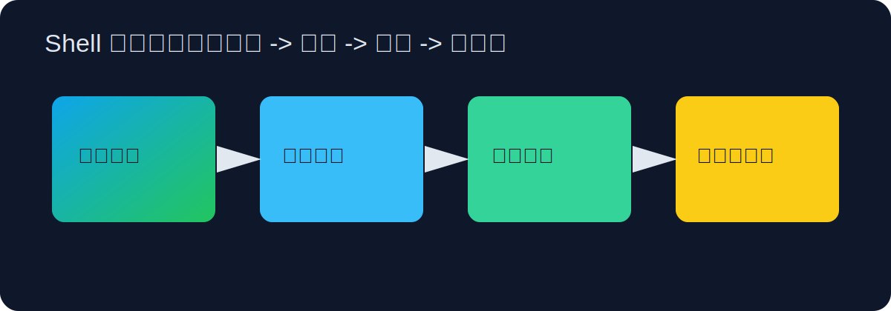

## 导读



很多人接触命令行时，会把 Shell 理解成“黑底白字的输入框”。真正的 Shell 是一门“把意图翻译成系统动作”的语言层，它把操作拆成可组合、可追踪的步骤。Shell 会变成“核心生产力”。

如果你希望通过一个原则迅速建立正确心智模型，那就是：**Shell 不是在背命令，而是在管理数据流**。你在终端里输入的每条命令，本质上都在处理输入、生成输出，或者改变系统状态。你把 `ls` 的输出交给 `grep`，再交给 `awk`，最后重定向到文件，这条链路就构成了一个小型数据处理管道。掌握这个模型后，你会发现常见命令不再零散，脚本也不再神秘。

在正式使用前，建议先确认你使用的是哪种 Shell。macOS 默认是 Zsh，绝大多数 Linux 发行版默认是 Bash；Fish 更偏交互体验，PowerShell 在 Windows 场景更常见。它们在“日常交互命令”上高度相似，但在脚本语法上并不完全兼容。你可以用下面的方式快速确认环境：

```bash
echo "$SHELL"
bash --version
zsh --version || true
fish --version || true
```

理解文件系统是 Shell 的第一步。`pwd` 告诉你当前所在路径，`ls -alh` 让你看到隐藏文件、权限、大小与修改时间，`cd` 负责切换上下文。这里最容易被忽略的点是“上下文成本”：很多命令失败并不是命令本身有问题，而是你在错误目录执行了它。因此，养成“先看路径再改文件”的习惯非常关键：

```bash
pwd
ls -alh
cd ~/workspace/project
```

当你开始操作文件时，建议从“可逆优先”的习惯出发。比如复制使用 `cp -av`，移动使用 `mv -iv`，删除前先验证目标集合再执行清理：

```bash
find ./logs -type f -name "*.log" -mtime +7 -print
# 确认输出无误后再删除
find ./logs -type f -name "*.log" -mtime +7 -delete
```

文本流处理是 Shell 最有价值的能力之一。你会经常把多个“小而专注”的命令拼成一个流程：`grep` 过滤、`awk` 提取、`sort` 排序、`uniq -c` 统计。比如定位 Nginx 访问日志里出现最多的状态码：

```bash
awk '{print $9}' access.log | sort | uniq -c | sort -nr
```

这个例子里，`awk '{print $9}'` 取第 9 列状态码，`sort` 把相同值聚拢，`uniq -c` 统计重复次数，最后 `sort -nr` 按数值倒序输出。复杂问题通常不是靠一条神奇命令解决，而是靠清晰的数据流设计解决。

重定向与管道是这套思维的语法基础。`>` 覆盖写入，`>>` 追加写入，`2>` 重定向错误流，`2>&1` 把错误并入标准输出。很多线上排错的关键证据都来自日志重定向：

```bash
./deploy.sh > deploy.out.log 2> deploy.err.log
./deploy.sh > deploy.all.log 2>&1
```

如果你的脚本会长期运行，建议统一把输出写入带时间戳的日志文件，并配合 `tee` 实现“终端可见 + 文件持久化”：

```bash
./job.sh 2>&1 | tee "job-$(date +%F-%H%M%S).log"
```

Shell 脚本编写阶段，最值得先建立的是“防御性默认值”。几乎所有生产脚本都应该在开头加入：

```bash
#!/usr/bin/env bash
set -euo pipefail
IFS=$'\n\t'
```

`set -e` 让命令失败时及时退出，`set -u` 防止未定义变量悄悄变成空字符串，`pipefail` 避免管道中前置命令失败被掩盖。`IFS` 的设置可以减少空格分词意外。记住它们在做同一件事：**把“静默错误”尽可能提前暴露**。

参数处理推荐使用 `getopts`。很多新手脚本只能处理固定输入，随着需求增加就会变成难以维护的分支泥潭。`getopts` 能让脚本拥有稳定接口，例如 `-f` 指定文件、`-o` 指定输出、`-v` 打开详细模式：

```bash
#!/usr/bin/env bash
set -euo pipefail

file=""
out="result.txt"
verbose=0

while getopts ":f:o:v" opt; do
  case "$opt" in
    f) file="$OPTARG" ;;
    o) out="$OPTARG" ;;
    v) verbose=1 ;;
    *) echo "Usage: $0 -f <file> [-o output] [-v]"; exit 1 ;;
  esac
done

[[ -n "$file" ]] || { echo "-f is required"; exit 1; }
[[ -f "$file" ]] || { echo "file not found: $file"; exit 1; }

(( verbose )) && echo "processing: $file -> $out"
grep -E "ERROR|WARN" "$file" > "$out"
```

脚本调试时，`bash -n` 用来做语法检查，`set -x` 用来追踪执行过程，`echo $?` 用来读取上条命令退出码。如果脚本在本地正常而在 CI 失败，优先打印 `pwd`、`whoami`、`env` 与关键路径变量，绝大多数问题都与“环境差异”有关，而不是语法本身。

进程管理是 Shell 的第二增长曲线。`jobs` 查看当前会话任务，`bg`/`fg` 在后台与前台切换，`nohup` 保证会话断开后继续运行，`ps -ef | grep xxx` 与 `kill -15 PID` 负责定位与优雅结束。这里建议坚持“先 TERM 后 KILL”：

```bash
kill -15 <pid>   # 给程序清理资源的机会
kill -9 <pid>    # 仅在无响应时使用
```

权限系统是很多“命令看起来没错但就是失败”的根因。`chmod` 管理读写执行位，`chown` 管理属主与属组，`umask` 决定新文件默认权限。你不必在一开始就深入 ACL，只要先记住：脚本文件要执行，至少需要 `x`；团队共享目录要协作，通常需要统一组权限。常见写法如：

```bash
chmod 755 deploy.sh
chmod 644 app.conf
chown -R devops:devops ./project
umask 022
```

命令行网络诊断是另一项高频能力。`curl -I` 看响应头，`curl -v` 看握手细节，`nc -zv host port` 测端口连通，`ss -tulpen` 看本机监听。排查时按链路逐段验证：域名解析、TCP 连接、HTTP 状态、应用日志。

当你把这些能力组合起来，你就能设计一个稳定的日常自动化框架：定时拉取日志、过滤错误、生成摘要、归档压缩、发送告警。Shell 的价值不在于一条命令省了几秒，而在于它能把长期重复动作变成可靠流程，让你把注意力留给更有价值的问题。

真正决定脚本质量的不是花哨写法，而是“输入验证、依赖检查、异常处理、日志记录”这些基础约束是否到位。你越早把这些约束固化，后续维护和排错就越轻松。

## 从命令到脚本的迁移路径

很多学习者会在“会敲命令”阶段停留很久，原因是缺少迁移路径：不知道什么时候该从单条命令升级为函数、从函数升级为脚本。一个实用判断标准是“重复次数”和“失败成本”。如果某个操作一周内会做三次以上，就值得写成函数；如果这个操作会改系统状态（例如清理、备份、发布），就应该升级成脚本，并加上参数校验和日志。

在 Bash/Zsh 中，别名适合简短替换，函数适合轻量逻辑，脚本适合版本化与团队共享。脚本入口可先输出当前运行上下文与依赖检查，例如：

```bash
echo "shell=$SHELL user=$(whoami) pwd=$(pwd)"
command -v awk grep sed >/dev/null || { echo "missing dependency"; exit 1; }
```

这两行看似简单，却能在远程主机或容器里提升可观测性。命令行学习到最后，关键是“流程写得稳”。

## 常用命令与参数清单（可直接查阅）

### 文件与目录

- `ls -alh`：`-a` 包含隐藏文件，`-l` 长格式，`-h` 人类可读大小。
- `cp -av src dst`：`-a` 保留属性递归复制，`-v` 显示过程。
- `mv -iv old new`：`-i` 覆盖前询问，`-v` 输出详情。
- `rm -rf path`：`-r` 递归，`-f` 强制；仅在确认路径后使用。
- `find . -type f -name "*.log" -mtime +7`：按类型、名称、修改时间筛选。

### 文本处理

- `grep -Rni "error" .`：`-R` 递归，`-n` 行号，`-i` 忽略大小写。
- `awk -F',' '{print $1,$3}' file.csv`：`-F` 指定分隔符。
- `sed -n '1,20p' file`：`-n` 静默，`p` 打印指定行。
- `sort -nr`：`-n` 按数值，`-r` 倒序。
- `uniq -c`：统计连续重复行次数。

### 进程与系统

- `ps -ef`：完整进程列表。
- `top -o cpu`：按 CPU 排序（不同系统参数略有差异）。
- `kill -15 PID`：优雅终止。
- `kill -9 PID`：强制终止。
- `nohup cmd > out.log 2>&1 &`：会话断开后继续运行。

### 网络与调试

- `curl -I URL`：仅请求响应头。
- `curl -v URL`：输出详细调试信息。
- `nc -zv host 443`：仅测试端口连通性。
- `ss -tulpen`：查看监听端口、协议、进程。

### 脚本质量

- `bash -n script.sh`：语法检查。
- `bash -x script.sh`：执行追踪。
- `shellcheck script.sh`：静态检查（推荐安装）。

## 延伸阅读

- [GNU Bash Manual](https://www.gnu.org/software/bash/manual/)
- [ShellCheck](https://www.shellcheck.net/)
- [Explain Shell](https://explainshell.com/)
- [The Linux Command Line](https://linuxcommand.org/tlcl.php)
